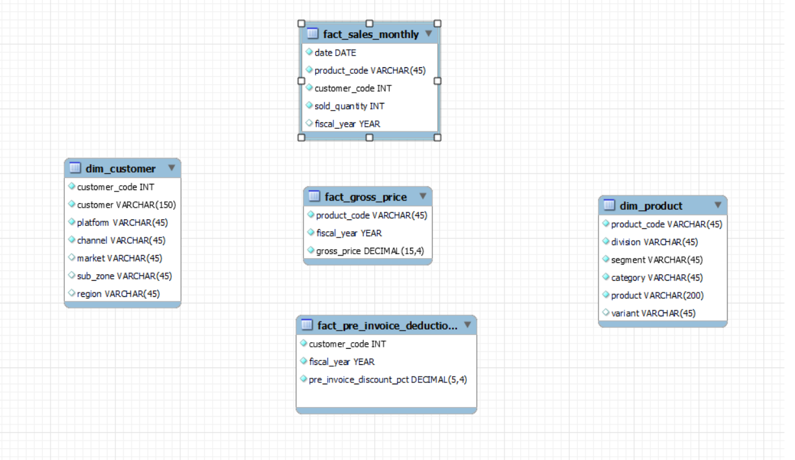

# Code_basic_SQL_Resume_Challenge

__Atliq Hardwares (imaginary company)__ is one of the leading computer hardware producers in India and well expanded in other countries too.
However, the management noticed that they do not get enough insights to make quick and smart data-informed decisions. They want to expand their data analytics team by adding several junior data analysts. Tony Sharma, their data analytics director wanted to hire someone who is good at both tech and soft skills. Hence, he decided to conduct a SQL challenge which will help him understand both the skills.

### Problem Statment

__10 Ad_hoc_Requests__ are given us . To read _Ad_hoc_request__ refer to this file __ad-hoc-requests.pdf__.Our main goal is to use __SQL__ to answer the __ad_hoc_quries__ to top level management. To see my __SQL_QURIES_CODE__ visit to this file __Ad_hoc_requests_Shehryar_Gondal.sql__.

## Project Flow Steps 

* 
<a href="#link1">Business Requirement Document & Data Gathering Source</a>

* 
<a href="#link2">Database Schema</a>

* 
<a href="#link2">Insights from Ad_hoc_Requests</a>

 

# <h2 id="link1">Business Requirement Document and Data Gathering</h2>
 

This file provides a comprehensive overview of the tables found in the __'gdb041' (atliq_hardware_db) database__. It includes information for six main tables:

1. __dim_customer__: contains customer-related data
2. __dim_product__: contains product-related data
3. __fact_gross_price__: contains gross price information for each product
4. __fact_manufacturing_cost__: contains the cost incurred in the production of each product
5. __fact_pre_invoice_deductions__: contains pre-invoice deductions information for each product
6. __fact_sales_monthly__: contains monthly sales data for each product.

__Data Defination__
 

#### Table 1  
Column Description for __dim_customer table__:
1. customer_code: The 'customer_code' column features unique identification codes for every customer in the dataset. These codes can be used to track a customer's sales 		history, demographic information, and other relevant details. For example, the codes could look like '70002017', '90005160', and '80007195' respectively.

2. customer: The 'customer' column lists the names of customers, for example 'Atliq Exclusive', 'Flipkart', and 'Surface Stores' etc.

3. platform: The 'platform' column identifies the means by which a company's products or services are sold. "Brick & Mortar" represents the physical store/location, and 			"E-Commerce" represents online platforms.

4. channel: The 'channel' column reflects the distribution methods used to sell a product. These methods include "Retailers", "Direct", and "Distributors". Retailers 				refer to physical or online stores that sell products to consumers. Direct sales refer to sales made directly to consumers through a company's website or other direct means, and distributors refer to intermediaries or middlemen between the manufacturer and retailer or end consumers.

5. market: The 'market' column lists the countries in which the customer is located.

6. region: The 'region' column categorizes countries according to their geographic location, including "APAC" (Asia Pacific), "EU" (Europe), "NA" (North America), and 			    "LATAM" (Latin America).

7. sub_zone: "The 'sub_zone' column further breaks down the regions into sub-regions, such as "India", "ROA" (Rest of Asia), "ANZ" (Australia and New Zealand), "SE" 	
 

#### Table 2  
Column Description for __dim_product table__:
1. product_code: The 'product_code' column features unique identification codes for each product, serving as a means to track and distinguish individual products within a 		database or system.

2. division: The 'division' column categorizes products into groups such as "P & A" (Peripherals and Accessories), "N & S" (Network and Storage) and "PC" (Personal 				 Computer).

3. segment: The 'segment' column categorizes products further within the division, such as "Peripherals" (keyboard, mouse, monitor, etc.), "Accessories" (cases, cooling 			solutions, power supplies), "Notebook" (laptops), "Desktop" (desktops, all-in-one PCs, etc), "Storage" (hard disks, SSDs, external storage), and "Networking" (routers, switches, modems, etc.).

4. category: The 'category' column classifies products into specific subcategories within the segment.

5. product: The 'product' column lists the names of individual products, corresponding to the unique identification codes found in the 'product_code' column.

6. variant: The "variant" column classifies products according to their features, prices, and other characteristics. The column includes variants such as "Standard","Plus", "Premium" that represent different versions of the same product.

#### Table 3  
Column Description for __fact_gross_price table__:
1. product_code: The 'product_code' column features unique identification codes for each product.

2. fiscal_year: The 'fiscal_year' column contains the fiscal period in which the product sale was recorded. A fiscal year is a 12-month period that is used for accounting 			purposes and often differs from the calendar year. For Atliq Hardware, the fiscal year starts in September. The data available in this column covers the 				fiscal years 2020 and 2021.

3. gross_price: The 'gross_price' column holds the initial price of a product, prior to any reductions or taxes. It is the original selling price of the product.

#### Table 4  
Column Description for __fact_manufacturing_cost__:
1. product_code: The 'product_code' column features unique identification codes for each product

2. cost_year: The "cost_year" column contains the fiscal year in which the product was manufactured.

3. manufacturing_cost: The "manufacturing_cost" column contains the total cost incurred for the production of a product. This cost includes direct costs like
raw materials, labor, and overhead expenses that are directly associated with the production process.

#### Table 5  
Column Description for __fact_pre_invoice_deductions__:
1. customer_code: The 'customer_code' column features unique identification codes for every customer in the dataset. These codes can be used to track a customer's sales 			history, demographic information, and other relevant details. For example, the codes could look like '70002017', '90005160', and '80007195' respectively.

2. fiscal_year: The "fiscal_year" column holds the fiscal period when the sale of a product occurred.

3. pre_invoice_discount_pct: The "pre_invoice_discount_pct" column contains the percentage of pre-invoice deductions for each product. Pre-invoice deductions are 
discounts that are applied to the gross price of a product before the invoice is generated, and typically applied to large orders or 

#### Table 6  
Column Description for __fact_sales_monthly__:
1. date: The "date" column contains the date when the sale of a product was made, in a monthly format for 2020 and 2021 fiscal years. This information can be used
to understand the sales performance of products over time.

2. product_code: The "product_code" column contains a unique identification code for each product. This code is used to track and differentiate individual 
products within a database or system.

3. customer_code: The 'customer_code' column features unique identification codes for every customer in the dataset. These codes can be used to track a customer's sales 			history, demographic information, and other relevant details. For example, the codes could look like '70002017', '90005160', and '80007195' respectively.

4. sold_quantity: The "sold_quantity" column contains the number of units of a product that were sold. This information can be used to understand the sales volume ofproducts and to compare the sales volume of different products or variants.

5. fiscal_year: The "fiscal_year" column holds the fiscal period when the sale of a product occurred.
 

# <h2 id="link2">Database Schema</h2>  

 

# <h2 id="link3">Insights from Ad_hoc_Requests</h2>  

__Key Insights__  

*  The customer 'Atliq Exclusive' operates in 3 regions - APAC, EU, NA. In APAC region it operates its business in - Australia, Bangladesh, India, Indonesia, Japan, New Zealand, Philippines and South Korea.  
* Unique_products in 2020 are 245 and Unique_Products in 2021 are 334.So,89 unique products were added in 2021. As a result, the percentage of unique product increase in 2021 vs. 2020 is 36.33%. 
*  The products are divided into 6 segments - Notebook, Accessories, Peripherals, Desktop, Storage and Networking. 
* Notebook, Accessories and Peripherals are the top 3 segments by unique product count. 
* Desktop, Storage and Networkings are the least 3 segments by unique product count. 
* Accessories segment has the most increase and Networking segment has the least increase in unique products in 2021 vs 2020. 
* AQ HOME Allin1 Gen 2 has highest manufacturing cost and AQ Master wired x1 Ms has lowest manufacturing cost. 
* Top 5 customers who received an average high pre_invoice_discount_pct for the fiscal year 2021 and in the Indian market are - Flipkart, Viveks, Ezone, Croma, Amazon. 
* For the fiscal year, 2020, March was the least performing month and November was the highest performing month. 
* Overall for 2019, 2020 and 2021, April was the least performing month and November was the highest performing month. 
* Quarter 1 ('September', 'October', 'November') got the maximum total sold quantity. 
* Quarter 3 ('March', 'April', 'May') got the minimum total sold quantity. 
* Retailer channel helped to bring most gross sales i.e., 73.22%, in the fiscal year 2021.  
* Direct channel  bring   gross sales i.e., 15.47%, in the fiscal year 2021.  

* Distributor channel bring gross sales i.e., 11.31%, in the fiscal year 2021.  

* For fiscal year 2021, N & S division have the highest total sold quantity with products AQ Pen Drive 2 IN 1 Premium (Quantity sold : 701373), AQ Pen Drive DRC (Plus)(Quantity sold : 688003) and AQ Pen Drive DRC (Premium)(Quantity sold :676245) being the top 3 products that have a high total sold quantity. 

* For fiscal year 2021, P & A division have the highest total sold quantity with products AQ Gamers Ms (Standard 2)(Quantity sold : 428498), AQ Maxima Ms (Standard 1)(Quantity sold : 419865) and AQ Maxima MS (Plus 2) (Quantity sold :419471)  being the top 3 products that have a high total sold quantity. 

* For fiscal year 2021, PC division have the highest total sold quantity with products AQ Digit (Standard Blue)(Quantity sold : 17434), AQ Velocity (Plus Red)(Quantity sold : 17280) and AQ Digit(Premium Misty Green) (Quantity sold : 17275)being the top 3 products that have a high total sold quantity. 

### AUTHOR

<strong>Shehryar Gondal</strong>

You can get in touch with me on my LinkedIn Profile: 
 

You can also follow my GitHub Profile to stay updated about my latest projects: 

If you liked the repo then kindly support it by giving it a star ⭐.

